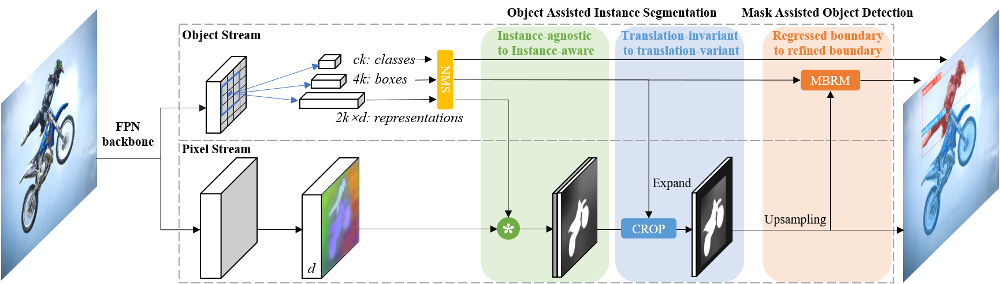
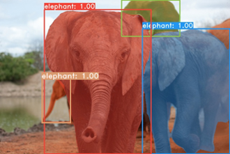

## RDSNet

The Code for "[RDSNet: A New Deep Architecture for Reciprocal Object Detection and Instance Segmentation](https://arxiv.org/abs/1912.05070)"

This repository is based on [mmdetection](https://github.com/open-mmlab/mmdetection).



## Installation

Please refer to [INSTALL.md](docs/INSTALL.md) for installation and dataset preparation.

## Performance on COCO



| Backbone              | Iteration | MBRM  |  Training scales  | AP<sup>bb</sup><br>(minival) | AP<sup>m</sup><br>(minival) | AP<sup>bb</sup><br>(test-dev) | AP<sup>m</sup><br>(test-dev)|  Model      |
| :-------------------: | :-------: | :---: | :---------------: | :-------------: | :--------------: | :-------------: | :--------------: | :--------: |
| ResNet-50-FPN         | 90k       | N     | 800               | 36.8            | 32.1             | 37.2            | 32.6             | [Link](https://drive.google.com/open?id=1_D1taHnljoZOhi5UPqDAe4QdUcAylnIJ )                                                      |
| ResNet-50-FPN         | -         | Y     | -                 | 37.8            | 32.1             | 38.1            | 32.6             |                                                       |
| ResNet-101-FPN        | 90k       | N     | 800               | 38.7            | 34.1             | 39.4            | 34.6             | [Link](https://drive.google.com/open?id=16DK0RFs6IDygGfMn6Lmo1ZdgT5RER4oq )                                                      |
| ResNet-101-FPN        | -         | Y     | -                 | 39.7            | 34.1             | 40.3            | 34.6             |                                                       |
| ResNet-101-FPN        | 180k      | N     | [640, 800]        | 40.8            | 36.2             | 40.9            | 36.4             | [Link](https://drive.google.com/open?id=1uB7IlN9crzZCNE8Q40q4dRehtbeiyB3F )                                                      |
| ResNet-101-FPN        | -         | Y     | -                 | 41.8            | 36.2             | 41.8            | 36.4             |                                                      |

The models with MBRM share the same parameters as those w/o MBRM, since the additional parameters in MBRM have been provided in the code. 

## Get Started

Once the installation is done, you can follow the below steps to test or train the model.

Assume that you have already prepared COCO dataset and downloaded the checkpoints to 'checkpoints/'.

### A quick demo:

```shell
python tools/test.py configs/rdsnet/rdsnet_r50_fpn_1x.py \
    checkpoints/rdsnet_r50_fpn_1x-124f64c3.pth \
    --show
```
### Config Files:

| Config File                                          | Backbone              | Iteration |  Training scales  | MBRM  |
| :--------------------------------------------------: | :-------------------: | :-------: | :---------------: | :---: |
| rdsnet_r50_fpn_1x.py                  | ResNet-50-FPN         | 90k       | 800               | N     |
| rdsnet_refine_r50_fpn_1x.py           | ResNet-50-FPN         | -         | -                 | Y     |
| rdsnet_r101_fpn_1x.py                 | ResNet-101-FPN        | 90k       | 800               | N     |
| rdsnet_refine_r101_fpn_1x.py          | ResNet-101-FPN        | -         | -                 | Y     |
| rdsnet_640_800_r101_fpn_2x.py         | ResNet-101-FPN        | 180k      | [640, 800]        | N     |
| rdsnet_640_800_refine_r101_fpn_2x.py  | ResNet-101-FPN        | -         | -                 | Y     |

All config files are in the folder: `configs/rdsnet/`

### Test on COCO dataset:

```shell
# single-gpu testing
python tools/test ${CONFIG_FILE} ${CHECKPOINT_FILE} --out ${RESULT_FILE} [--eval ${EVAL_METRICS}] [--show]

# multi-gpu testing
./tools/dist_test.sh ${CONFIG_FILE} ${CHECKPOINT_FILE} $GPU_NUM} [--out ${RESULT_FILE}] [--eval ${EVAL_METRICS}]
```

Arguments:
- `CONFIG_FILE`: Path to one of the file in `configs/rdsnet/`.
- `CHECKPOINT_FILE`: Path to the checkpoints.

Optional arguments:
- `RESULT_FILE`: Filename of the output results in pickle format. If not specified, the results will not be saved to a file.
- `EVAL_METRICS`: Items to be evaluated on the results. Recommended values are: `bbox`, `segm`.
- `--show`: If specified, detection results will be plotted on the images and shown in a new window. It is only applicable to single GPU testing. Please make sure that GUI is available in your environment, otherwise you may encounter the error like `cannot connect to X server`.

## Train a model

### Train with multiple GPUs
```shell
./tools/dist_train.sh ${CONFIG_FILE} ${GPU_NUM} [optional arguments]
```

Optional arguments:

- `--validate` (**strongly recommended**): Perform evaluation at every k (default value is 1, which can be modified like [this](../configs/mask_rcnn_r50_fpn_1x.py#L174)) epochs during the training.)
- `--work_dir ${WORK_DIR}`: Override the working directory specified in the config file.
- `--resume_from ${CHECKPOINT_FILE}`: Resume from a previous checkpoint file.

All outputs (log files and checkpoints) will be saved to the working directory, which is specified by `work_dir` in the config file.

**\*Important\***: We use 4 GPUs with 2 img/gpu. The default learning rate in config files is also for **4 GPUs** and 2 img/gpu (batch size= 4\*2 = 8).

According to the [Linear Scaling Rule](https://arxiv.org/abs/1706.02677), you need to set the learning rate proportional to the batch size if you use different GPUs or images per GPU, e.g., lr=0.01 for 8 GPUs * 2 img/gpu.

For some other high-level apis, please refer to [GETTING_STARTED.md](docs/GETTING_STARTED.md).


## Citation

Please consider citing our paper in your publications if the project helps your research.

```bash
@misc{wang2019rdsnet,
    title={RDSNet: A New Deep Architecture for Reciprocal Object Detection and Instance Segmentation},
    author={Shaoru Wang and Yongchao Gong and Junliang Xing and Lichao Huang and Chang Huang and Weiming Hu},
    year={2019},
    eprint={1912.05070},
    archivePrefix={arXiv},
    primaryClass={cs.CV}
}

```
